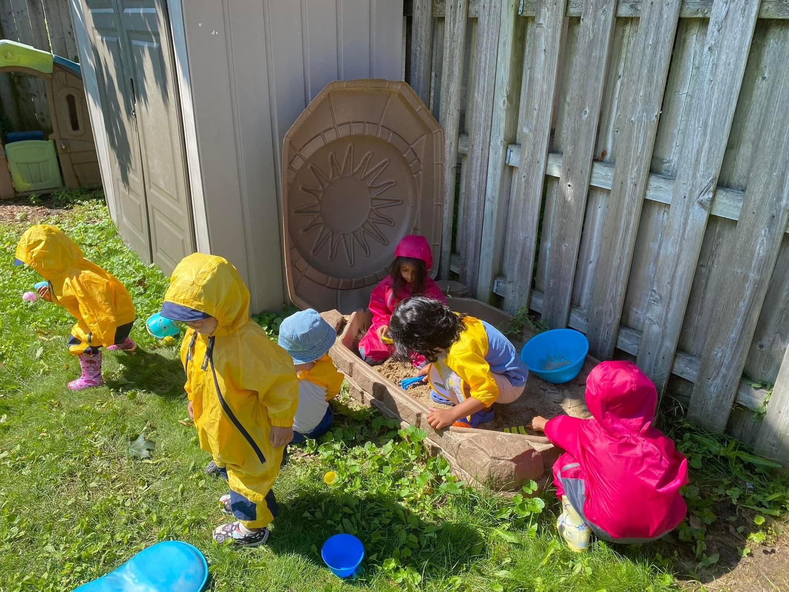

# Little Minds Preschool & Childcare

Modern, Montessori-inspired preschool website and AI assistant for **Little Minds Preschool & Childcare** in Whitby, ON.

## Overview

This project is a single-page marketing site plus an integrated AI-style assistant designed to help parents:

- Learn about the school’s **Montessori-inspired philosophy** and calm, prepared environment  
- Explore **Infant, Toddler, and Pre‑K** program details  
- Browse a **scrolling photo gallery** with click‑to‑zoom lightbox  
- Read **parent testimonials** and view **contact/location** information  
- Ask questions, book tours, and send enquiries via the **Little Minds AI Assistant**

Live site:  
`https://little-minds-preschool-childcare.netlify.app`

## Tech stack

- Static **HTML**, **CSS**, and **JavaScript** (no build step required)  
- Lightweight custom **chatbot widget** with predefined flows for:
  - FAQs (fees, meals, ratios, timings, etc.)
  - Tour booking conversation
  - Enrollment enquiries and lead capture
- Email integration using `mailto:` so enquiries open an email to  
  **littlemindschildcarebrooklin@gmail.com**

